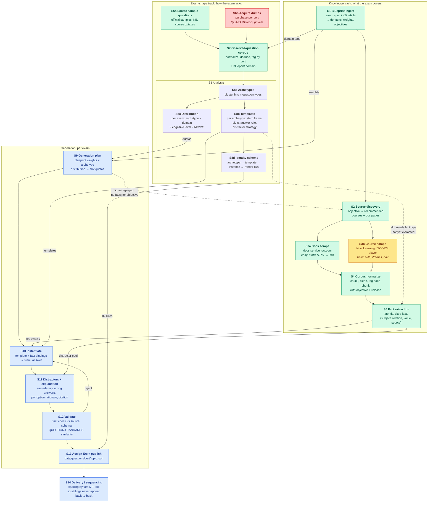
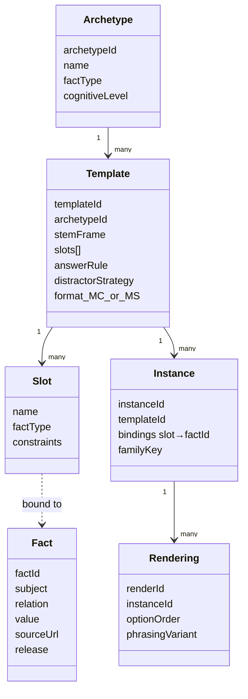
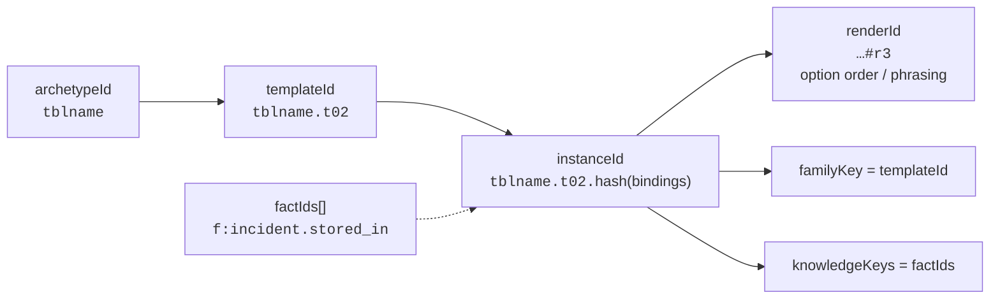
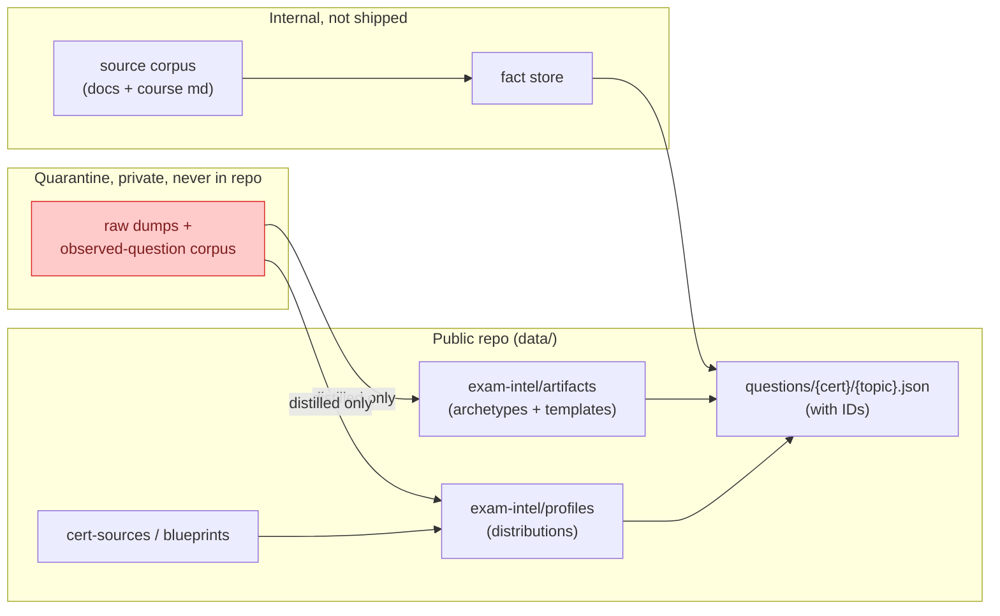

# Question Generation Pipeline (Concept)

> Covers how SNReady goes from an exam blueprint to a deduplicated, parameterized question bank, for every certification.
>
> **Status (2026-10-07):** every stage except S3b (course scraping) is implemented in `pipeline/` and proven end-to-end on CSA. See [`pipeline/README.md`](../pipeline/README.md) for commands. LLM stages (S5, S8a, S8b, S11) run as Claude Code agent packets. Deviations from this concept: the fact vocabulary lives in `pipeline/lib/fact-types.ts`, and templates support five answer modes (`single`, `reverse`, `members`, `non_member`, `ordinal`).

## 1. Overview

The pipeline has two input tracks that join in a generator:

- **Knowledge track:** what the exam *covers*. Blueprint → courses + docs → verified facts.
- **Exam-shape track:** how the exam *asks*. Official questions only (blueprint samples, MeasureUp practice exams, dumps) → question archetypes, templates, distributions. SNReady's own question bank is never a source.

The generator fills **templates** (shape) with **facts** (content), sized to the **distribution** (weights). Every output carries an **ID** that ties it to its family.

**Legend:** green = straightforward, amber = hard to automate (course scraping), red = private/quarantined input, blue = generation.

## 2. Stages

### Knowledge track

| # | Stage | Input | Output | Notes |
|---|-------|-------|--------|-------|
| S1 | Blueprint ingest | Exam spec PDF / KB article | `blueprint.json`: domains, weights, objectives, release, item count, MC/MS mix | Partly exists in `data/cert-sources/cert-sources.csv` |
| S2 | Source discovery | Objectives | `sources.json`: objective → course IDs, doc URLs | Courses come from the blueprint's "recommended training". Docs come from course references plus docs search per objective |
| S3a | Docs scrape | Doc URLs | Markdown per page, with release version | `sn-docs` skill already does this |
| S3b | Course scrape | Course IDs | Markdown per lesson | Needs authenticated session and walking the Rustici SCORM player. See `docs/SCORM-Content-Extraction-Guide.md` |
| S4 | Corpus normalize | Raw md | Chunks tagged `{cert, objective, source, release}` | One corpus shared across certs (many certs share docs) |
| S5 | Fact extraction | Chunks | Fact store: `{factId, subject, relation, value, factType, sourceUrl, quote}` | Facts are what get parameterized. Every fact must cite a source |

### Exam-shape track

| # | Stage | Input | Output | Notes |
|---|-------|-------|--------|-------|
| S6a | Locate sample questions | Web, KB, Now Learning | Official sample items per cert | Few items, but they are authoritative on style |
| S6b | Acquire dumps | Purchased dumps | Raw items, **private, outside the repo** | Guardrail in `data/exam-intel/README.md`: no raw dump text in public data |
| S7 | Observed-question corpus | S6a + S6b | Normalized items tagged with cert + domain | Dedupe across dump vendors (they copy each other) |
| S8a | Archetypes | Corpus | The *n* question types, e.g. "entity → table name", "role → capability", "where do you configure X" | Extends `data/exam-intel/artifacts/servicenow-core-artifacts.json` (13 today) |
| S8b | Templates | Archetype clusters | Per archetype, one or more stem frames with typed slots | See §3 |
| S8c | Distribution | Corpus + blueprint | Per exam: share of each archetype, per domain, cognitive level, MC vs MS | Extends `data/exam-intel/profiles/*` |
| S8d | Identity scheme | Templates | ID rules (§4) | Defined once, applied at S13 |

### Generation

| # | Stage | What happens |
|---|-------|--------------|
| S9 | Plan | `target_count × domain_weight × archetype_share` → quota per (domain, archetype). Flags quotas with no facts available (sends a feedback edge to S2) |
| S10 | Instantiate | Pick a template and bind its slots to facts of the right `factType`. Answer comes from the template's answer rule |
| S11 | Distractors + explanation | Distractors come from same-`factType` facts (plausible siblings). Explanation follows the per-wrong-answer format in `QUESTION-STANDARDS.md` |
| S12 | Validate | Check the answer against the cited quote. Check schema. Check semantic similarity against the existing bank and against dump items, so we don't reproduce dumps verbatim |
| S13 | IDs + publish | Assign IDs (§4) and write to `data/questions/{cert}/{topic}.json` |
| S14 | Sequencing | The quiz engine spaces out items that share a family or a fact |

## 3. Anatomy of a parameterized question

Example:

| Layer | Value |
|-------|-------|
| Archetype | `entity_table_name_lookup` |
| Template | `"Which table stores {entity} records?"` · slot `entity: factType=entity_table_name` · answer = `fact.value` · distractors = 3 other `entity_table_name` values from the same app family |
| Fact | `subject=Incident, relation=stored_in, value=incident` |
| Instance | `entity=Incident` → *"Which table stores Incident records?"* → `incident` |
| Sibling instance | `entity=Problem` → *"Which table stores Problem records?"* → `problem` |
| Rendering | Same instance with shuffled options, or the alternate phrasing *"Incident records are stored in which table?"* |

## 4. Identity scheme

Different questions can be too similar in two ways. The ID scheme needs to capture both:

1. **They look alike.** Same template, different slot values. Incident→table and Problem→table read almost the same.
2. **They answer each other.** Different templates that test the same fact. One question can give away the answer to the other.

Proposed IDs:

- **`instanceId`** = `{archetype}.{template}.{hash(sorted slot→factId bindings)}`. Deterministic, so regenerating gives the same ID, and two instances with identical bindings collide on purpose.
- **`renderId`** = `{instanceId}#r{n}`. Cosmetic variants of one instance count as the *same question* for scoring and repetition.
- **`familyKey`** = `templateId`. Covers "looks alike".
- **`knowledgeKeys`** = the set of `factId`s used, including the answer fact. Covers "answers each other".
- The public `questionId` used in routes (`/[cert]/questions/[topic]/[questionId]`) can stay a short slug that maps to `instanceId`.

**Sequencing rule (S14):** in a session, after showing an item, block any item with the same `familyKey` for the next *k₁* items and any item sharing a `knowledgeKey` for the next *k₂* items. Never show two renderings of the same `instanceId` in one session.

## 5. Data artifacts and where they live

## 6. Open questions

1. **Archetype granularity.** Is *n* a single global list across all certs (13 today), or global core types plus cert-specific ones?
2. **Course access.** Which certs' recommended courses can we reach with our Now Learning account? Some sit behind partner or customer entitlements.
3. **Release drift.** Should facts be versioned per ServiceNow release (Yokohama, Zurich, …) so a blueprint update only regenerates the affected instances?
4. **Dump trust.** Dumps contain wrong answers. Should they inform *shape* only (archetypes, distribution) and never *answers*? (Recommended: yes. Answers always come from the fact store.)
5. **Existing bank.** Do we back-fill IDs and archetype tags on the current questions (via the existing `profile-existing-questions.ts` path) or regenerate from scratch?
